<div align="center">
  
</div>

<br>

<div align="center">

[](https://git.io/typing-svg)

</div>

<br>

---

<br>

```
  ╔══════════════════════════════════════════════════════════════════╗
  ║  root@simo:~$ cat about.txt                                      ║
  ╠══════════════════════════════════════════════════════════════════╣
  ║                                                                  ║
  ║  ◈  Name     →  Simo                                             ║
  ║  ◈  Role     →  Backend & Cybersecurity Developer                ║
  ║  ◈  Company  →  Aryaplus  [ aryaplus.it ]                        ║
  ║  ◈  Uni      →  Computer Science @ University of Catania         ║
  ║  ◈  Learning →  Operating System  ·  Compilers                   ║
  ║  ◈  Base     →  Catania, Sicily                                  ║
  ║  ◈  Status   →  [ ██████████░░░░ ] compiling life.jar ...        ║
  ║                                                                  ║
  ╚══════════════════════════════════════════════════════════════════╝
```

<br>

---

## ⚙️ &nbsp;`// TECH STACK`

<br>

**Languages**


**Frameworks & Frontend**


**Infra, DB & Tools**


<br>

---

## 📡 &nbsp;`// CURRENT MISSION`

<br>

```python
class Simo:

    def __init__(self):
        self.name        = "Simo"
        self.role        = ["Backend Developer", "Cybersecurity Enthusiast"]
        self.languages   = ["it_IT", "en_US"]
        self.company     = "Aryaplus"
        self.university  = "UniCT — Computer Science"

    def currently_doing(self):
        return {
            "building"  : "Aryaplus platform 🚀",
            "learning"  : ["Operating System", "Compilers"],
            "obsessed_with": ["clean architecture", "ethical hacking", "performance"],
        }

    def life_philosophy(self):
        print("// Scrivi codice come se il prossimo manutentore")
        print("// fosse un hacker che sa dove abiti.")

me = Simo()
me.currently_doing()
```

<br>

---

## 🚀 &nbsp;`// PROJECTS`

<br>

```
  ╔══════════════════════════════════════════════════════════════════╗
  ║  root@simo:~$ ls -la ./projects/                                 ║
  ╠══════════════════════════════════════════════════════════════════╣
  ║                                                                  ║
  ║  ◈  Aryaplus          →  [ LIVE ]  aryaplus.it                   ║
  ║     Corporate frontend                                           ║
  ║                                                                  ║
  ║  ◈  [REDACTED]        →  [ WIP  ]  private access only           ║
  ║     root@simo:~$ cat project2.txt                                ║
  ║     bash: permission denied  —  try harder                       ║
  ║                                                                  ║
  ╚══════════════════════════════════════════════════════════════════╝
```

<br>

---

## 🐍 &nbsp;`// COMMIT HISTORY — FEEDING THE SNAKE`

<br>

<div align="center">
<picture>
  <source media="(prefers-color-scheme: dark)"  srcset="https://raw.githubusercontent.com/tobiasmeyhoefer/tobiasmeyhoefer/output/github-snake-dark.svg"/>
  <source media="(prefers-color-scheme: light)" srcset="https://raw.githubusercontent.com/tobiasmeyhoefer/tobiasmeyhoefer/output/github-snake.svg"/>
  
</picture>
</div>

<br>

---

<div align="center">

```
  ┌─────────────────────────────────────────────┐
  │  root@simo:~$ echo "grazie per la visita"   │
  │  grazie per la visita                        │
  │  root@simo:~$ █                              │
  └─────────────────────────────────────────────┘
```

</div>
